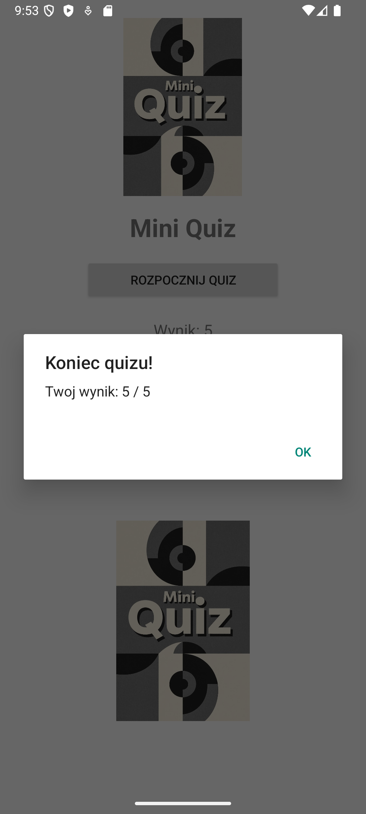
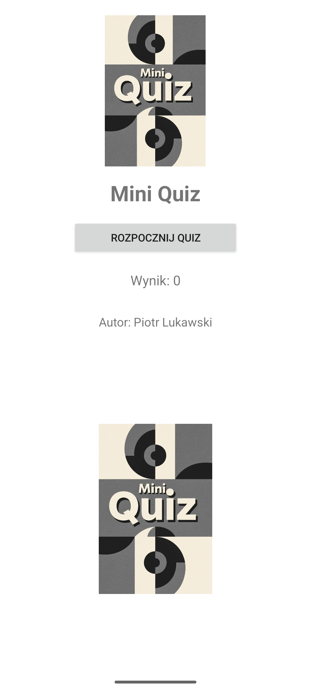
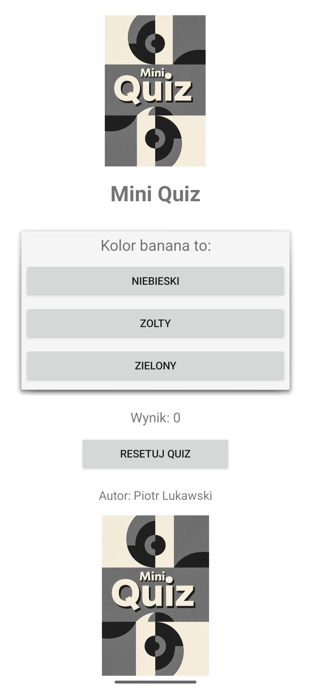

# 🎯 MiniQuiz

MiniQuiz to prosta aplikacja na Androida napisana w języku **Java**, pozwalająca użytkownikowi sprawdzić swoją wiedzę w krótkim quizie.  
Aplikacja losuje pytania z zestawu i umożliwia wybór jednej z trzech odpowiedzi.  
Na końcu pokazuje wynik oraz daje możliwość zresetowania quizu.

---

## 🧩 Funkcjonalności

- Wyświetlanie losowych pytań z trzema odpowiedziami.  
- Liczenie punktów za poprawne odpowiedzi.  
- Przycisk **"Rozpocznij Quiz"** uruchamia test.  
- Przycisk **"Resetuj Quiz"** pozwala rozpocząć od nowa.  
- Prosty, intuicyjny interfejs z grafiką na górze i dole ekranu.  

---

## ⚙️ Instrukcja uruchomienia

1. **Sklonuj lub pobierz projekt**:
   ```bash
   git clone https://github.com/twoj-login/MiniQuiz.git




